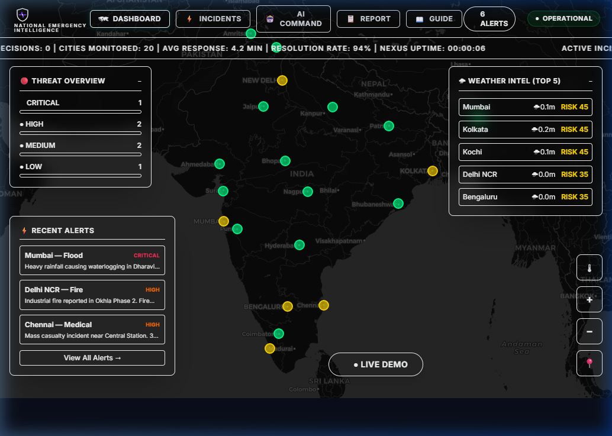

# NEXUS

> **National Emergency eXpertise & Unified System**
> *India's AI-Powered Emergency Intelligence Platform*


> NEXUS is a real-time, AI-powered national emergency management platform
> that monitors 20 major Indian cities, fuses live weather data with citizen
> reports, and delivers intelligent decision support to emergency coordinators
> — all deployed free on Render with no billing required.

---

## 🗂 Table of Contents

- [🌐 Live Demo](#live-demo)
- [✨ Features](#features)
- [🏗 Architecture](#architecture)
- [🗂 Project Structure](#project-structure)
- [🖥 Pages & Screens](#pages--screens)
- [🤖 AI Intelligence Layer](#ai-intelligence-layer)
- [🗺 Maps & Location](#maps--location)
- [🌦 Weather Integration](#weather-integration)
- [🌐 Multilingual Support](#multilingual-support)
- [📡 API Reference](#api-reference)
- [⚙️ Environment Variables](#environment-variables)
- [🚀 Deployment Guide](#deployment-guide)
- [🧪 Local Development](#local-development)
- [📊 Risk Score Formula](#risk-score-formula)
- [🏙 Monitored Cities](#monitored-cities)
- [🛠 Tech Stack](#tech-stack)
- [📖 How to Use](#how-to-use)
- [🤝 Contributing](#contributing)
- [📄 License](#license)

---

## 🌐 Live Demo

| Service | URL | Status |
|---------|-----|--------|
| 🖥 Frontend | [https://nexus-client.onrender.com](https://nexus-client.onrender.com) | [](https://nexus-client.onrender.com) |
| ⚙️ Backend API | [https://nexus-server.onrender.com](https://nexus-server.onrender.com) | [](https://nexus-server.onrender.com) |
| ❤️ Health Check | [https://nexus-server.onrender.com/health](https://nexus-server.onrender.com/health) | [](https://nexus-server.onrender.com/health) |

> ⚠️ **Note:** The backend runs on Render's free tier.
> First load after inactivity may take 30–60 seconds to wake up.
> The self-ping mechanism keeps it alive during active use.

### 📸 Application Preview

#### Interactive Command Center Dashboard


#### Automated Demo Mode Playback


---

## ✨ Features

### 🗺 Real-Time Mapping
- Interactive Leaflet map with CartoDB dark tiles (no API key needed)
- 20 Indian cities shown as color-coded risk circles
- Circle size scales with city population
- Pulsing animation for critical zones (score > 70)
- Heatmap overlay showing incident density
- Floating intelligence panels over the map

### 🤖 AI Decision Support
- Google Gemini 1.5 Flash for all intelligence queries
- Streaming responses with typewriter effect
- Structured output: Threat Assessment → Risk Analysis → Actions → Outlook
- Forecast windows: 4, 12, 24, 48 hours
- City-specific or All India analysis
- PDF export of any AI report

### 📡 Live Data Fusion
- Real weather from Open-Meteo (rain, wind speed) for all 20 cities
- Citizen report ingestion and AI classification
- Risk score updates every 15 seconds
- Alert polling every 5 seconds with toast notifications

### 📋 Citizen Report Portal
- 7 Indian languages: English, Hindi, Tamil, Telugu, Malayalam, Bengali, Kannada
- GPS live location detection via browser Geolocation API
- Nominatim reverse geocoding (free, no key)
- Voice input via Web Speech API
- AI auto-classification with bilingual summary
- Unique tracking ID per report

### 📖 Guide & Documentation
- In-app user guide with step-by-step instructions
- Risk score formula explained visually
- Emergency contact numbers for India
- FAQ accordion

### 🎬 Demo Mode
- 11-step automated demo sequence
- Real AI calls during demo (not mocked)
- Map animations, alert injections, AI streaming
- Fully hands-free for judge presentations

---

## 🏗 Architecture

### System Architecture Diagram

```
┌─────────────────────────────────────────────────────────────┐
│                     NEXUS PLATFORM                          │
│                                                             │
│  ┌──────────────────────────────────────────────────────┐  │
│  │                  FRONTEND (React)                    │  │
│  │           Render Static Site — Free Tier             │  │
│  │                                                      │  │
│  │  ┌──────────┐ ┌──────────┐ ┌──────────┐            │  │
│  │  │Dashboard │ │Incidents │ │AI Command│            │  │
│  │  │ Leaflet  │ │  Feed +  │ │ Gemini   │            │  │
│  │  │   Map    │ │ Filters  │ │ Stream   │            │  │
│  │  └──────────┘ └──────────┘ └──────────┘            │  │
│  │  ┌──────────┐ ┌──────────┐                         │  │
│  │  │  Report  │ │  Guide   │                         │  │
│  │  │ 7 Langs  │ │  Docs    │                         │  │
│  │  └──────────┘ └──────────┘                         │  │
│  └──────────────────────────────────────────────────────┘  │
│                          │                                  │
│                    REST + SSE                               │
│                          │                                  │
│  ┌──────────────────────────────────────────────────────┐  │
│  │                BACKEND (Node.js/Express)             │  │
│  │              Render Web Service — Free Tier          │  │
│  │                                                      │  │
│  │  ┌───────────┐  ┌───────────┐  ┌───────────┐       │  │
│  │  │  /alerts  │  │   /ai     │  │  /risk    │       │  │
│  │  │  CRUD +   │  │ analyze   │  │  scores   │       │  │
│  │  │ simulate  │  │ classify  │  │ formula   │       │  │
│  │  └───────────┘  └───────────┘  └───────────┘       │  │
│  │                                                      │  │
│  │  In-Memory Store (alerts[], aiCount, startTime)     │  │
│  │  Self-ping every 9 min → /health (prevent sleep)    │  │
│  └──────────────────────────────────────────────────────┘  │
│          │                    │                │            │
│          ▼                    ▼                ▼            │
│  ┌──────────────┐  ┌──────────────┐  ┌──────────────┐     │
│  │ Google       │  │ Open-Meteo   │  │  Nominatim   │     │
│  │ Gemini       │  │ Weather API  │  │  Geocoding   │     │
│  │ 1.5 Flash    │  │ (Free)       │  │  (Free)      │     │
│  │ (AI Engine)  │  │ Rain + Wind  │  │  Reverse geo │     │
│  └──────────────┘  └──────────────┘  └──────────────┘     │
└─────────────────────────────────────────────────────────────┘
```

### Data Flow Diagram

```
CITIZEN REPORT FLOW:
─────────────────────────────────────────────────────────
Citizen opens /report
      │
      ▼
Select language (EN/HI/TA/TE/ML/BN/KN)
      │
      ▼
Click "Detect My Location"
      │
      ├─► navigator.geolocation.getCurrentPosition()
      │         │
      │         ▼
      │   Nominatim reverse geocode
      │   (lat,lng → city, state, district)
      │         │
      │         ▼
      │   Mini Leaflet map shown with marker
      │
      ▼
Fill description (text or 🎤 voice input)
      │
      ▼
Submit → POST /api/ai/classify
      │
      ▼
Gemini 1.5 Flash classifies:
  type | severity | city | summaries | confidence
      │
      ▼
Alert added to in-memory store
      │
      ▼
Dashboard map circle flashes + toast shown
      │
      ▼
Citizen receives: Tracking ID + bilingual summary


EMERGENCY INTELLIGENCE FLOW:
─────────────────────────────────────────────────────────
Coordinator opens /ai
      │
      ▼
Select: [4 HR] [12 HR] [24 HR] [48 HR]
      │
      ▼
Select: City or All India
      │
      ▼
Type query or click Quick Command
      │
      ▼
POST /api/ai/analyze
      │
      ├─► Fetch current alerts[]
      ├─► Fetch risk scores (Open-Meteo weather)
      ├─► Detect season (monsoon June-Sep)
      ├─► Get current IST time
      │
      ▼
Build system prompt + user context
      │
      ▼
Gemini 1.5 Flash (streaming)
      │
      ▼
SSE stream → frontend typewriter effect
      │
      ▼
Parse sections: 🔴 📊 ✅ ⏱ 🎯
      │
      ▼
Render as distinct colored cards
      │
      ▼
Export as PDF (optional)


RISK SCORE CALCULATION FLOW:
─────────────────────────────────────────────────────────
GET /api/risk-scores (called every 15 seconds)
      │
      ▼
For each of 20 cities in parallel (Promise.all):
      │
      ├─► Open-Meteo API call
      │     ?latitude={lat}&longitude={lng}
      │     &current=rain,windspeed_10m
      │     &timezone=Asia/Kolkata
      │         │
      │         ▼
      │   weatherRisk:
      │     rain > 10mm  → 40 pts
      │     rain > 5mm   → 25 pts
      │     rain > 0mm   → 10 pts
      │     wind > 50    → +20 pts
      │     wind > 30    → +10 pts
      │
      ├─► Count active alerts for this city
      │     × 20 per alert (cap: 60)
      │     + severity weights
      │
      ├─► Season bonus:
      │     Jun-Sep (monsoon)  → +15
      │     Mar-May (pre-mon)  → +5
      │
      ▼
score = min(100, weatherRisk + incidentRisk + seasonBonus)
      │
      ▼
Update map circle colors:
  0-30  → #00ff88 green
  31-50 → #ffd700 yellow
  51-70 → #ff6b00 orange
  71+   → #ff2d55 red
```

### Frontend Page Flow

```
                    ┌─────────────────┐
                    │  NEXUS App.jsx  │
                    │  React Router   │
                    └────────┬────────┘
                             │
         ┌───────────────────┼───────────────────┐
         │           ┌───────┤───────┐           │
         ▼           ▼       │       ▼           ▼
    ┌─────────┐ ┌─────────┐  │  ┌─────────┐ ┌─────────┐
    │Dashboard│ │Incidents│  │  │AI Command│ │  Guide  │
    │   /     │ │/incidents│  │  │  /ai    │ │ /guide  │
    │         │ │         │  │  │         │ │         │
    │Leaflet  │ │Alert    │  │  │Forecast │ │How to   │
    │Map      │ │Feed     │  │  │Window   │ │Use      │
    │20 cities│ │Filters  │  │  │4/12/24/ │ │Risk     │
    │Risk     │ │AI per   │  │  │48 HR    │ │Formula  │
    │circles  │ │incident │  │  │AI Chat  │ │FAQ      │
    │Heatmap  │ │Resolve  │  │  │Stream   │ │Contacts │
    │Panels   │ │Deploy   │  │  │PDF Out  │ │         │
    └─────────┘ └─────────┘  │  └─────────┘ └─────────┘
                             │
                        ┌─────────┐
                        │ Report  │
                        │/report  │
                        │         │
                        │7 Langs  │
                        │GPS Loc  │
                        │Voice    │
                        │AI Class │
                        │Track ID │
                        └─────────┘
```

---

## 🗂 Project Structure

```
nexus/
│
├── render.yaml                  # Render Blueprint (deploys both services)
├── README.md                    # This file
│
├── client/                      # React Frontend
│   ├── package.json
│   ├── tailwind.config.js
│   ├── public/
│   │   └── index.html
│   └── src/
│       ├── index.js             # React entry point
│       ├── App.jsx              # Router + layout wrapper
│       ├── api.js               # All backend API calls (centralized)
│       ├── translations.js      # 7 Indian language strings
│       ├── styles/
│       │   └── animations.css   # All keyframe animations
│       ├── components/
│       │   ├── Navbar.jsx       # Fixed top nav with live clock
│       │   ├── StatusBar.jsx    # Scrolling metrics ticker
│       │   ├── ToastAlert.jsx   # New alert popup notifications
│       │   └── PageTransition.jsx
│       └── pages/
│           ├── Dashboard.jsx    # Map + floating panels + demo mode
│           ├── Incidents.jsx    # Alert feed + filters + AI per incident
│           ├── AICommand.jsx    # Forecast window + AI chat + streaming
│           ├── Report.jsx       # Citizen portal + GPS + voice + multilingual
│           └── Guide.jsx        # Docs + FAQ + emergency contacts
│
└── server/                      # Node.js Backend
    ├── package.json
    ├── server.js                # Express app + in-memory store + keep-alive
    ├── data/
    │   └── cities.js            # 20 Indian cities with lat/lng/population
    └── routes/
        ├── alerts.js            # GET/POST/PATCH alerts + simulate
        ├── ai.js                # Gemini analyze + classify endpoints
        └── risk.js              # Risk score calculation + Open-Meteo
```

---

## 🖥 Pages & Screens

### 1. Dashboard (/)
The command center. Full-screen dark Leaflet map of India with floating panels.

| Panel | Position | Content |
|-------|----------|---------|
| Threat Overview | Top-left | Critical/High/Medium/Low counts |
| Weather Intel | Top-right | Top 5 risk cities with rain+wind |
| Recent Alerts | Bottom-left | Last 3 alerts mini cards |
| Map Controls | Bottom-right | Heatmap toggle, zoom, my location |
| LIVE DEMO button | Bottom-center | Triggers 11-step automated demo |

### 2. Incidents (/incidents)
Full incident management with filtering and per-incident AI analysis.

Features:
- Filter by type: Flood / Fire / Medical / Accident / Power
- Filter by severity: Critical / High / Medium / Low
- Search by city name
- Inline AI analysis panel per incident
- Mark resolved with visual stamp
- Deploy resources dropdown

### 3. AI Command (/ai)
Split-panel intelligence interface.

Left panel controls:
- Forecast window: 4 / 12 / 24 / 48 hours
- City selector: All India or specific city
- 8 quick command buttons
- Custom query textarea
- Query history chips

Right panel output:
- Streaming Gemini response
- Emoji-sectioned cards
- Confidence badge
- Copy / PDF export buttons

### 4. Report (/report)
Citizen emergency reporting portal with full multilingual support.

Steps:
1. Select language (7 options)
2. Detect GPS location or select city manually
3. Choose emergency type (6 icons)
4. Choose severity (4 levels)
5. Describe in text or voice
6. Submit → receive tracking ID

### 5. Guide (/guide)
In-app documentation and onboarding.

Sections:
- Feature cards overview
- Tabbed how-to guide per page
- Risk score formula visualization
- Data sources
- FAQ accordion
- Emergency contact numbers

---

## 🤖 AI Intelligence Layer

**Model:** Google Gemini 1.5 Flash
**Mode:** Streaming (SSE) for real-time typewriter display

### AI Endpoints

| Endpoint | Purpose | Streaming |
|----------|---------|-----------|
| POST /api/ai/analyze | Intelligence queries with forecast window | ✅ Yes |
| POST /api/ai/classify | Citizen report classification | ❌ No (JSON) |

### System Prompt Design

NEXUS AI is prompted to:
- Respond as a system named NEXUS, not as an AI assistant
- Use real Indian city names and emergency agency names
- Reference NDRF, SDRF, MCGM, BBMP, KSEB, CESC, TNEB, IMD
- Include monsoon context during June–September
- Structure every response with exactly 5 emoji-marked sections
- End with a confidence percentage

### Response Format

```
🔴 THREAT ASSESSMENT
Current situation summary

📊 RISK ANALYSIS
City-by-city or incident breakdown

✅ RECOMMENDED ACTIONS
1. Action with responsible agency
2. Action with responsible agency
3. Action with responsible agency

⏱ {N}-HOUR OUTLOOK
Timeline prediction

🎯 CONFIDENCE: X%
Justification
```

### Classification Output (JSON)

```json
{
  "type": "Flood",
  "severity": "High",
  "city": "Kochi",
  "state": "Kerala",
  "summary_english": "Rising water levels near Edappally junction.",
  "summary_hindi": "एडापल्ली जंक्शन के पास जल स्तर बढ़ रहा है।",
  "summary_regional": "എടപ്പള്ളി ജംഗ്ഷനു സമീപം ജലനിരപ്പ് ഉയരുന്നു.",
  "confidence": 91,
  "recommended_authority": "Kerala SDMA"
}
```

---

## 🗺 Maps & Location

**Library:** Leaflet.js (open source, free)
**Tiles:** CartoDB Dark Matter (free, no API key required)
**Heatmap:** leaflet.heat plugin

### Why Leaflet + OpenStreetMap?

| Feature | Leaflet + OSM | Google Maps |
|---------|--------------|-------------|
| Cost | Free forever | Billing after limits |
| API Key | Not required | Required |
| Dark tiles | CartoDB (free) | Paid Map ID |
| Hackathon safe | ✅ Yes | ⚠️ Risky |

### Location Detection Stack

```
Browser Geolocation API
          │
          ▼
   { latitude, longitude }
          │
          ▼
   Nominatim Reverse Geocoding
   https://nominatim.openstreetmap.org/reverse
          │
          ▼
  { city, state, district, postcode }
          │
          ▼
  Mini Leaflet map thumbnail
  + Auto-fill form fields
  + Store coords for alert
```

---

## 🌦 Weather Integration

**Provider:** Open-Meteo (completely free, no API key)
**Endpoint:**
```
https://api.open-meteo.com/v1/forecast
  ?latitude={lat}
  &longitude={lng}
  &current=rain,windspeed_10m
  &timezone=Asia/Kolkata
```

**Update frequency:** Every 15 seconds (parallel for all 20 cities)

**Weather → Risk mapping:**

| Condition | Points Added |
|-----------|-------------|
| Rain > 10mm/hr | +40 |
| Rain > 5mm/hr | +25 |
| Rain > 0mm/hr | +10 |
| Wind > 50 km/h | +20 |
| Wind > 30 km/h | +10 |
| Monsoon season (Jun-Sep) | +15 |
| Pre-monsoon (Mar-May) | +5 |

---

## 🌐 Multilingual Support

NEXUS supports 7 Indian languages for citizen reporting:

| Language | Code | Script | Voice Input |
|----------|------|--------|-------------|
| English | en | Latin | ✅ |
| Hindi | hi | Devanagari | ✅ |
| Tamil | ta | Tamil | ✅ |
| Telugu | te | Telugu | ✅ |
| Malayalam | ml | Malayalam | ✅ |
| Bengali | bn | Bengali | ✅ |
| Kannada | kn | Kannada | ✅ |

All UI strings (placeholders, labels, buttons, messages) switch
instantly when language is selected. No page reload required.

AI classification works on input in any of these languages.
Gemini 1.5 Flash handles all 7 natively without additional config.

Output always includes:
- English summary
- Hindi summary
- Regional language summary (if different from above)

---

## 📡 API Reference

Base URL: `https://nexus-server.onrender.com`

### Health

```
GET /health
Response: {
  status: "NEXUS operational",
  uptime: 3600,
  alerts: 6,
  aiDecisions: 14
}
```

### Alerts

```
GET /api/alerts
Returns all active alerts sorted newest first.

GET /api/alerts?all=true
Returns all alerts including resolved.

POST /api/alerts
Body: {
  type: "Flood",
  city: "Mumbai",
  state: "Maharashtra",
  location: { lat: 19.076, lng: 72.877 },
  severity: "Critical",
  description: "string"
}
Returns: created alert object

PATCH /api/alerts/:id/resolve
Marks alert as resolved.
Returns: updated alert

POST /api/alerts/simulate
No body required.
Returns: randomly generated realistic Indian alert
```

### Risk Scores

```
GET /api/risk-scores
Returns: {
  "mumbai": {
    score: 87,
    weatherRisk: 40,
    incidentRisk: 40,
    rain: 12.4,
    wind: 38,
    cityName: "Mumbai",
    state: "Maharashtra",
    lat: 19.076,
    lng: 72.877
  },
  ... (all 20 cities)
}
```

### AI

```
POST /api/ai/analyze
Body: {
  query: "Which cities need NDRF deployment?",
  forecastHours: 24,
  cityId: "all"
}
Response: SSE stream
  data: {"text": "🔴 THREAT"}
  data: {"text": " ASSESSMENT\n"}
  ...
  data: [DONE]

POST /api/ai/classify
Body: {
  text: "വെള്ളം ഉയരുന്നു",
  language: "Malayalam"
}
Response: {
  classification: { type, severity, city, state,
    summary_english, summary_hindi,
    summary_regional, confidence,
    recommended_authority },
  alertId: 1234567890,
  trackingId: "NEXUS-1234567890-ab3f"
}
```

### Stats

```
GET /api/stats
Response: {
  totalAlerts: 8,
  aiDecisions: 23,
  activeCities: 5,
  uptime: 7200
}
```

---

## ⚙️ Environment Variables

### Backend (server/.env for local / Render dashboard for production)

| Variable | Required | Description |
|----------|----------|-------------|
| `GEMINI_API_KEY` | ✅ Yes | Google Gemini API key from [aistudio.google.com](https://aistudio.google.com) |
| `RENDER_EXTERNAL_URL` | Auto-set | Set automatically by Render for self-ping |
| `PORT` | Auto-set | Set automatically by Render (8080) |

### Frontend (client/.env for local)

| Variable | Required | Description |
|----------|----------|-------------|
| `VITE_API_URL` | ✅ Yes | Backend URL. Set to `http://localhost:8080` locally |

> All other services (Open-Meteo, Nominatim, CartoDB tiles, OpenStreetMap)
> are completely free and require no API keys.

---

## 🚀 Deployment Guide

**Render — Free, No Credit Card**

### Step 1 — Push to GitHub

```bash
cd nexus
git init
git add .
git commit -m "NEXUS v1.0 — initial build"
git remote add origin https://github.com/YOUR_USERNAME/nexus-ai.git
git branch -M main
git push -u origin main
```

### Step 2 — Deploy on Render

1. Go to [render.com](https://render.com) → Sign up free
2. Click **New** → **Blueprint**
3. Connect your GitHub account
4. Select the `nexus-ai` repository
5. Render reads `render.yaml` automatically
6. Both services (`nexus-server` + `nexus-client`) deploy simultaneously

### Step 3 — Set Environment Variable

1. In Render dashboard → click `nexus-server`
2. Go to **Environment** tab
3. Add: `GEMINI_API_KEY` = `your_key_here`
4. Click **Save Changes** → service redeploys automatically

### Step 4 — Verify

```bash
# Check backend health
curl https://nexus-server.onrender.com/health

# Should return:
# {"status":"NEXUS operational","uptime":120,"alerts":6,"aiDecisions":0}
```

### Free Tier Notes

| Limit | Free Tier | Impact |
|-------|-----------|--------|
| Sleep after inactivity | 15 min | Self-ping prevents this |
| Monthly hours | 750 hrs | Enough for 24/7 |
| Static site | Unlimited | Frontend never sleeps |
| Build minutes | 500/month | Sufficient |

---

## 🧪 Local Development

### Prerequisites

- Node.js 18+
- npm 9+
- Google Gemini API key (free at [aistudio.google.com](https://aistudio.google.com))

### Setup

```bash
# Clone repo
git clone https://github.com/YOUR_USERNAME/nexus-ai.git
cd nexus-ai

# Backend setup
cd server
npm install
echo "GEMINI_API_KEY=your_key_here" > .env
node server.js
# Backend runs at http://localhost:8080

# Frontend setup (new terminal)
cd ../client
npm install
echo "VITE_API_URL=http://localhost:8080" > .env
npm run dev
# Frontend runs at http://localhost:5173
```

### Available Scripts

```bash
# Backend
node server.js          # Start server
node server.js --watch  # With auto-restart (Node 18+)

# Frontend
npm run dev             # Development server
npm run build           # Production build
```

---

## 📊 Risk Score Formula

```
╔═══════════════════════════════════════════════════╗
║           NEXUS RISK SCORE FORMULA                ║
╠═══════════════════════════════════════════════════╣
║                                                   ║
║  score = min(100,                                 ║
║    weatherRisk + incidentRisk + seasonBonus       ║
║  )                                                ║
║                                                   ║
║  weatherRisk:                                     ║
║    rain > 10mm  → 40 pts                          ║
║    rain > 5mm   → 25 pts                          ║
║    rain > 0mm   → 10 pts                          ║
║    wind > 50    → +20 pts                         ║
║    wind > 30    → +10 pts                         ║
║                                                   ║
║  incidentRisk:                                    ║
║    alerts × 20 (capped at 60)                     ║
║    + Critical×15, High×10, Medium×5, Low×2        ║
║                                                   ║
║  seasonBonus:                                     ║
║    June–September (Monsoon)    → +15              ║
║    March–May    (Pre-monsoon)  → +5               ║
║    October–February            → +0               ║
║                                                   ║
╠═══════════════════════════════════════════════════╣
║  SCORE    LEVEL      COLOR    ACTION              ║
║  0–30     LOW        🟢 Green  Normal ops         ║
║  31–50    MODERATE   🟡 Yellow Monitor elevated   ║
║  51–70    HIGH       🟠 Orange Pre-position       ║
║  71–100   CRITICAL   🔴 Red    Emergency active   ║
╚═══════════════════════════════════════════════════╝
```

---

## 🏙 Monitored Cities

| # | City | State | Population | Coordinates |
|---|------|-------|------------|-------------|
| 1 | Delhi NCR | Delhi | 32,000,000 | 28.6139°N, 77.2090°E |
| 2 | Mumbai | Maharashtra | 21,000,000 | 19.0760°N, 72.8777°E |
| 3 | Kolkata | West Bengal | 15,000,000 | 22.5726°N, 88.3639°E |
| 4 | Bengaluru | Karnataka | 13,000,000 | 12.9716°N, 77.5946°E |
| 5 | Chennai | Tamil Nadu | 11,000,000 | 13.0827°N, 80.2707°E |
| 6 | Hyderabad | Telangana | 10,000,000 | 17.3850°N, 78.4867°E |
| 7 | Ahmedabad | Gujarat | 8,000,000 | 23.0225°N, 72.5714°E |
| 8 | Surat | Gujarat | 7,000,000 | 21.1702°N, 72.8311°E |
| 9 | Pune | Maharashtra | 7,000,000 | 18.5204°N, 73.8567°E |
| 10 | Jaipur | Rajasthan | 4,000,000 | 26.9124°N, 75.7873°E |
| 11 | Lucknow | Uttar Pradesh | 4,000,000 | 26.8467°N, 80.9462°E |
| 12 | Nagpur | Maharashtra | 3,000,000 | 21.1458°N, 79.0882°E |
| 13 | Bhopal | Madhya Pradesh | 2,000,000 | 23.2599°N, 77.4126°E |
| 14 | Patna | Bihar | 2,000,000 | 25.5941°N, 85.1376°E |
| 15 | Coimbatore | Tamil Nadu | 2,000,000 | 11.0168°N, 76.9558°E |
| 16 | Kochi | Kerala | 2,000,000 | 9.9312°N, 76.2673°E |
| 17 | Chandigarh | Punjab | 1,000,000 | 30.7333°N, 76.7794°E |
| 18 | Bhubaneswar | Odisha | 1,000,000 | 20.2961°N, 85.8245°E |
| 19 | Guwahati | Assam | 1,000,000 | 26.1445°N, 91.7362°E |
| 20 | Amritsar | Punjab | 1,000,000 | 31.6340°N, 74.8723°E |

---

## 🛠 Tech Stack

### Frontend
| Technology | Version | Purpose |
|------------|---------|---------|
| React | 18 | UI framework |
| React Router | 6 | Client-side routing |
| Tailwind CSS | 3 | Utility styling |
| Leaflet.js | 1.9 | Interactive maps |
| leaflet.heat | 0.2 | Heatmap overlay |
| jsPDF | 2.5 | PDF export |
| Web Speech API | Native | Voice input |

### Backend
| Technology | Version | Purpose |
|------------|---------|---------|
| Node.js | 18+ | Runtime |
| Express | 4.18 | HTTP framework |
| @google/generative-ai | 0.21 | Gemini SDK |
| axios | 1.6 | HTTP client |
| cors | 2.8 | Cross-origin requests |
| dotenv | 16 | Environment variables |

### External Services (All Free)
| Service | Cost | Purpose |
|---------|------|---------|
| Google Gemini 1.5 Flash | Free tier | AI intelligence |
| Open-Meteo | Free forever | Weather data |
| CartoDB Dark Tiles | Free | Map tiles |
| Nominatim | Free | Reverse geocoding |
| Render | Free tier | Hosting |

---

## 📖 How to Use

### For Emergency Coordinators

1. **Dashboard** → Watch live risk circles. Red = needs attention now.
2. **Incidents** → See full alert details, run AI analysis per incident.
3. **AI Command** → Set forecast window, ask anything in plain English.
4. **Export** → Download AI reports as PDF for offline briefings.

### For Citizens

1. Go to **/report** from the nav
2. Select your language
3. Tap **Detect My Location** for automatic GPS
4. Choose what type of emergency and how serious
5. Describe what you see (or use voice)
6. Submit → save your tracking ID

### For Demo / Presentation

1. Open Dashboard
2. Click the red **● LIVE DEMO** button
3. Watch the 11-step automated sequence run hands-free
4. Total runtime: ~46 seconds

---

## 🤝 Contributing

Pull requests welcome. For major changes please open an issue first.

```bash
git checkout -b feature/your-feature
git commit -m "Add your feature"
git push origin feature/your-feature
# Open PR on GitHub
```

## 📄 License

MIT License — free to use, modify, and distribute.

---

Built for the hackathon with ❤️ using Google Gemini AI,
Leaflet.js, OpenStreetMap, and Open-Meteo.

*NEXUS — Every second counts.*
